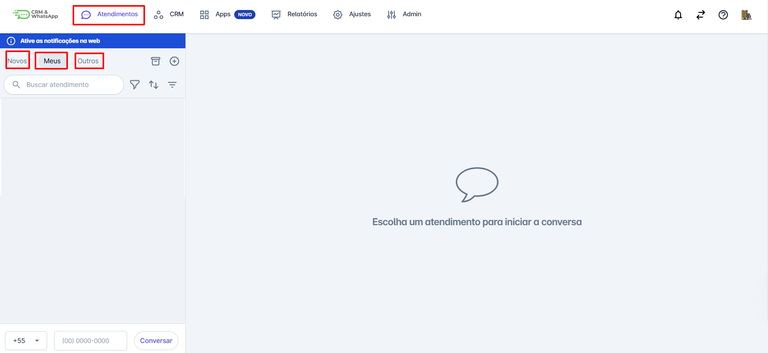

# Abas e filtros de conversas

Este guia oferece uma visão sobre como utilizar essas funcionalidades para melhorar a eficiência do seu trabalho e garantir que nenhuma comunicação importante seja perdida ou esquecida. Ao entender o funcionamento das abas e filtros, você poderá gerenciar suas conversas de forma mais eficaz e manter um alto nível de organização na sua plataforma Táime Pro.

**Pré-requisitos:**


Pré-requisitos:

* Acesso à conta na plataforma Táime Pro CRM.
* Estar incluído nas equipes para as quais os atendimentos são direcionados.os.


**Passo a Passo:** \
\
**Abas**: Na tela inicial da plataforma, clique na opção **"Atendimentos"**.

Logo abaixo, estão disponíveis 3 abas principais: **Novos**, **Meus** e **Outros**.\
\

<figure><figcaption></figcaption></figure>

* **Aba "Novos"**

A aba "Novos" é onde você encontra todas as novas conversas que ainda não foram iniciadas por nenhum usuário. Ou seja, são os contatos que estão aguardando atendimento. Nessa aba, você pode visualizar rapidamente todas as novas interações, garantindo que nenhuma mensagem fique sem respostas.

* **Aba "Meus"**

A aba "Meus" é dedicada às conversas que você deu início, ou seja, que você está atendendo. Esta aba permite que você acompanhe todas as interações que foram atribuídas a você, facilitando o controle e a organização do seu trabalho. Você pode acessar detalhes de cada conversa, responder mensagens e acompanhar o status das interações.

* **Aba "Outros"**

A aba Outros exibe as conversas que foram iniciadas por outros usuários da plataforma e que não estão sob seu atendimento direto. Você poderá visualizar apenas as conversas de usuários que pertencem à(s) mesma(s) equipe(s) que você integra, garantindo que as informações sejam compartilhadas apenas com membros relevantes.

Essa aba é útil para acompanhar atendimentos em andamento dentro da sua equipe, permitindo que você consulte o histórico, dê suporte a outro atendente quando necessário ou assuma a conversa em casos específicos, mantendo a continuidade do atendimento e a organização interna.

**Filtros**

* Na tela inicial da plataforma, clique na opção "Atendimentos".
* Logo abaixo, clique no ícone , e um menu de opções será exibido.
* É possível filtrar os atendimentos de acordo com: Canais (números, Messenger e Instagram).Etiquetas.Usuários.Equipes.

Os filtros ajudam a localizar e gerenciar atendimentos de forma mais eficiente, otimizando o uso da plataforma Táime Pro.\

<figure><figcaption></figcaption></figure>

* **Aplicando Filtros** \
  Para aplicar um filtro:\
  1\. Clique na **seta** do filtro desejado dentro do menu de opções.\
  2\. As opções relacionadas ao filtro serão exibidas.\
  3\. Selecione a opção desejada para filtrar os atendimentos.\
  4\. Clique fora do menu de opções para que o filtro seja aplicado automaticamente.

<figure><figcaption></figcaption></figure>

*   Quando um filtro está aplicado o í**cone correspondente ficará escuro**, indicando que o filtro está **ativo**. Isso ajuda a identificar facilmente que um filtro específico está em uso, garantindo um gerenciamento mais organizado dos atendimentos\

    <figure><figcaption></figcaption></figure>

<figure><figcaption></figcaption></figure>

* Você pode **ordenar os atendimentos** para facilitar a organização e priorização. Para isso:

1. Clique no ícone de ordenação.
2. Um menu com as opções será exibido:\
   **Mais antigos primeiro:** Exibe os atendimentos em ordem cronológica crescente.\
   **Últimas interações primeiro:** Exibe os atendimentos com as interações mais recentes no topo.

<figure><figcaption></figcaption></figure>

*   **Exibição de Mensagens Não Lidas**\
    1\. Clique no ícone.png>) .\
    2\. A lista será filtrada automaticamente, mostrando apenas as mensagens **não lidas.**

    <figure><figcaption></figcaption></figure>
* **Filtrar Apenas "Meus Atendimentos**\
  1\. "Clique no **ícone** .png>).\
  2\. Selecione a opção **"Meus Atendimentos".**\
  3\. A lista será atualizada para mostrar apenas os atendimentos que estão sob sua responsabilidade.

Você pode filtrar rapidamente para visualizar somente os atendimentos que foram atribuídos a você. Para isso:.\

<figure><figcaption></figcaption></figure>

**Considerações Adicionais:**

* O **perfil de Supervisor** tem permissão para visualizar todos os atendimentos da equipe que estiver inserido, inclusive interagir na conversa, transferir o atendimento e concluir.
